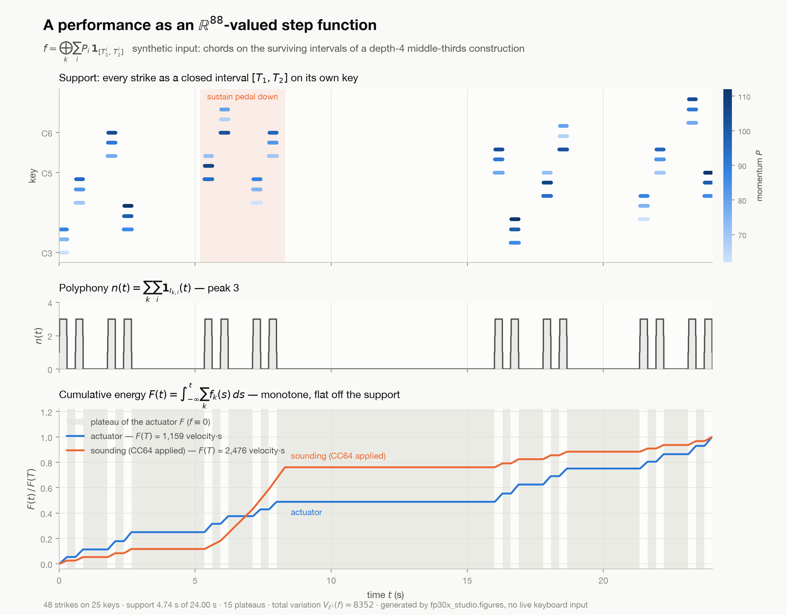

# FP-30X Studio

A small macOS desktop app that records what you play on a **Roland FP-30X**, saves it as a
MIDI file, renders it to audio, and plays it back.

It exists because getting sound off the piano is unreasonably hard by default, and the
obvious routes are all dead ends. See [Why this is hard](#why-this-is-hard).

```
./run.sh
```

Press **Record**, play, press **Stop**. The take is written to
`~/Music/FP-30X Studio/takes/` as a `.mid` and a `.wav`, and starts playing.

## What it does

- Finds the piano on CoreMIDI and shows a live connection indicator
- Live note feed with velocity bars, and a sustain-pedal indicator
- Saves a real Standard MIDI File — the notes, not a recording of them
- Renders to 44.1 kHz WAV via fluidsynth
- Keeps a list of takes; double-click one to play it

## Timing: the native capture front end

The app's Python capture polls the MIDI port and stamps each message with the time the
poll loop *noticed* it:

```python
while not stopped:
    for msg in inp.iter_pending(): record(time.time())
    time.sleep(0.002)
```

That imposes a ~2 ms quantisation on every take, and it is an artifact of our loop — not
of the piano, of MIDI, or of Bluetooth. `native/fp30x_capture.c` removes it.

CoreMIDI is callback-driven and every incoming `MIDIPacket` already carries a
`MIDITimeStamp` applied near the driver, before any of our code runs. Apple's SDK headers
(`MIDIServices.h`) define it as "A host clock time representing the time of an event, as
returned by `mach_absolute_time()`", applying to "the first MIDI byte in the packet". So
the right move is not a faster poll — it is not polling.

```
make -C native                                    # builds build/fp30x-capture
native/build/fp30x-capture -l                     # list CoreMIDI sources
native/build/fp30x-capture -s FP-30X -o take.fp30x
```

The receive callback runs on a thread CoreMIDI owns and prioritises, so it does nothing
but copy the timestamp and bytes into a preallocated lock-free ring — no allocation, no
locks, no I/O. A separate writer thread drains the ring to an append-only text file and
`fsync`s on a timer, so a crash or a laptop sleep costs at most the last unsynced
fragment.

The file is line-oriented and greppable — `<absolute_nanoseconds> <hex bytes>` with a
header carrying the `mach_timebase` numer/denom and a wall-clock anchor:

```
# fp30x-capture v1
# mach_timebase_numer 125
# mach_timebase_denom 3
# anchor_mach_ns 50666761187333
# anchor_unix_ns 1786981500562062000
50679390933166 90 3C 01
50679391832208 80 3C 40
# end packets 40 dropped 0 truncated 0 ts_zero 0 stopped_utc ...
```

`ts_zero` counts packets the *source* did not stamp; CoreMIDI documents a zero timestamp
as meaning "now", so those were stamped on arrival and are no better than the poll loop.
`RawCapture.hardware_timestamped` reads that trailer rather than assuming.

**Measured**, by `native/benchmark.py`, on **synthetic input** — a virtual CoreMIDI source
emitting at known intervals, scored against its own emission timestamps. 200 messages at
each of six spacings from 5 ms down to 100 µs:

| nominal spacing | C path median error | Python poll-loop median error | poll-loop p95 | intervals the poll loop collapsed |
| --- | --- | --- | --- | --- |
| 5000 µs | 0.0000 ms | 0.34 ms | 2.38 ms | 4/199 |
| 2000 µs | 0.0000 ms | 0.54 ms | 2.02 ms | 40/199 |
| 1000 µs | 0.0000 ms | 1.01 ms | 1.59 ms | 113/199 |
| 500 µs | 0.0000 ms | 0.50 ms | 2.04 ms | 152/199 |
| 200 µs | 0.0000 ms | 0.20 ms | 2.11 ms | 175/199 |
| 100 µs | 0.0000 ms | 0.09 ms | 0.25 ms | 182/199 |

"Collapsed" means the recorded interval came out under 20 µs when the true interval was
the nominal spacing — the poll loop read those messages in one pass and reported them as
simultaneous. At 1 ms spacing it does that to more than half of them.

The C path's timestamps were **bit-identical to the sender's** for all 1200 messages, with
zero dropped, so its error is exactly zero and its resolution is bounded by the mach tick,
41.67 ns. This measures the capture path only. It does not measure the piano, the key
action, or the Bluetooth link — see *Not done yet*.

Reading a capture back, through the same interface the polling front end uses:

```python
from fp30x_studio import rawcapture
from fp30x_studio.performance import Performance

cap = rawcapture.read("take.fp30x")
print(cap.summary())
perf = Performance.from_capture(cap)      # identical to a live core.Capture
perf = Performance.from_raw_capture("take.fp30x")   # or straight from the path
```

There is no second copy of the analysis: `RawCapture.messages` has exactly the
`[(seconds, mido.Message)]` shape `core.Capture` produces, and `inspect_capture.load()`
reads `.fp30x` alongside `.mid` and `.json`.

## The performance as a mathematical object

`fp30x_studio/performance.py` turns a take — a live `core.Capture` or a `.mid` on disk —
into the object it actually is, rather than a list of events.

A key struck with velocity `P` at `T1` and released at `T2` is the scaled indicator
`P · 1_[T1,T2]`. For one key those intervals are pairwise disjoint, because one actuator
cannot be in two states at once; that invariant is **checked and raised on**, at either
the strict grade (`I_i ∩ I_j = ∅`) or the a.e. grade (`λ(I_i ∩ I_j) = 0`, which is what a
legato repeat produces). The whole performance is the direct sum over the 88 keys,

```
f = ⊕_k Σ_i P_i · 1_[T1_i, T2_i] : ℝ → ℝ⁸⁸
```

an `ℝ⁸⁸`-valued step function of bounded variation. What the module computes from it:

- **total variation** `|Df|(ℝ)`, in `ℓ¹`, `ℓ²` or `ℓ∞` on `ℝ⁸⁸`
- **support measure** — the union across keys, not the sum
- **polyphony** `n(t) = Σ_k Σ_i 1_{I_k,i}(t)`, pointwise and as breakpoints
- **cumulative energy** `F(t) = ∫ f`, in closed form, with its plateau decomposition
- **evaluation** of the direct-sum vector at any `t`, and a structured-array / DataFrame export

The parser pairs note-ons to note-offs and reports every repair it had to make: orphan
note-ons, orphan note-offs, legato re-strikes on one key (the earlier interval is
truncated at the new onset — the hammer resets the string), zero-length notes, and notes
off the 88-key range. Sustain (CC64) maps the *actuator* representation to a *sounding*
one, extending each release that falls under the pedal.

```
python -m pytest tests/ -q            # 175 tests; the synthetic ones need no piano
python -m fp30x_studio.figures        # writes docs/cumulative-energy.png
```



## The pipeline: ingest once, ask many times

`fp30x_studio/pipeline/` turns a take into a materialised index — packets, messages,
paired intervals, defects, and one *role* per message — so that a measurement is a fold
over a table rather than another re-parse of the file.

```
python -m fp30x_studio.pipeline report 2026-08-17-piece    # is this take any good?
python -m fp30x_studio.pipeline queries                    # what can be asked
python -m fp30x_studio.pipeline query polyphony 2026-08-17-piece
python -m fp30x_studio.pipeline query key 2026-08-17-piece key=C4
python -m fp30x_studio.pipeline ingest --follow            # tail a take being recorded
```

`report` ingests first, so there is no step to remember. Ingest is **incremental**: the
`.fp30` format is append-only with monotone timestamps, so a byte offset plus the set of
keys currently down is a complete resume point, and the same code path serves a finished
take and one still being written. The index lives in `.index/` beside the take; it is
derived, deletable, and rebuilt by `ingest`.

Three properties, each bought by a specific failure:

- **Nothing is dropped.** Every message leaves the pairing layer with exactly one role —
  paired, orphaned, pedal, or explicitly classified — and the count of roles is asserted
  against the count of messages.
- **Nothing is recomputed by hand.** The pairing is computed once and written down, so two
  answers to the same question cannot disagree.
- **Nothing is inferred silently.** Each interval records *which observation closed it*, so
  a note-off that was never received cannot masquerade as a measured release; each take
  records how far its timestamps can be trusted, and timing-sensitive queries refuse to be
  quoted quietly against a poll-loop take.

The disjointness invariant in `performance.py` is not relaxed to accommodate bad data. A
re-strike closes the open interval **at the new onset** — the physically true reading, and
one that leaves the intervals meeting at a point, so `b_i ≤ a_{i+1}` still holds exactly.
No interval is invented; what is lost is only the release *time*, and the interval says so.

`integrity` reports health of the link, not of the playing: the 5 ms BLE arrival lattice
and its residue, the message-type census including the aftertouch null, and an inferred
loss rate. That last one is inference because it has to be — the capture tool's `dropped`
counter only sees packets CoreMIDI handed it, so radio-side loss is invisible to it by
construction. Every take's numbers are appended to the takes directory's `PROVENANCE.md`
automatically, once, the first time its stream is known to have ended.

## Requirements

- macOS
- Python 3.10+ with tkinter — `brew install python-tk@3.14` if `import tkinter` fails
- `brew install fluid-synth` for rendering
- The instrument set (38 MB, MIT licensed) downloads itself on first render

`run.sh` creates the virtualenv and installs Python dependencies on first launch.

## Connecting the piano

Bluetooth MIDI pairs in **Audio MIDI Setup**, not System Settings:

1. Open Audio MIDI Setup
2. **Window → Show MIDI Studio**
3. Click the **Bluetooth** toolbar icon
4. Connect to **`FP-30X MIDI`**

The port then appears in CoreMIDI as `FP-30X MIDI Bluetooth` and the app turns green.

A USB-C-to-USB-B cable into the piano's square **COMPUTER** port also works, and is the
only route that additionally carries digital audio.

## Why this is hard

Four dead ends, each of which looks like the right answer:

1. **`FP-30X Audio` over Bluetooth cannot carry audio out.** It is an A2DP sink —
   CoreAudio reports `in=0 out=2`. It streams *into* the piano's speakers. No setting
   changes this.
2. **Bluetooth MIDI is a second, separate pairing**, and macOS hides it in Audio MIDI Setup
   rather than System Settings. The BLE peripheral advertises as `FP-30X MIDI`, which is a
   different name from `FP-30X Audio`.
3. **The piano's USB-A socket is a host port for flash drives.** A USB-A-to-USB-C cable to
   a Mac is host-to-host and enumerates nothing at all — `system_profiler SPUSBDataType`
   silently reports zero devices. You need the square USB-B `COMPUTER` port.
4. **There is no Roland macOS driver, and one would not help.** Roland ships only a
   firmware updater. CoreMIDI already contains Apple's BLE-MIDI driver; it simply had
   nothing connected to it.

## Layout

| Path | What it is |
| --- | --- |
| `fp30x_studio/core.py` | Polling capture, render, playback. No GUI. |
| `fp30x_studio/app.py` | The tkinter interface. |
| `fp30x_studio/performance.py` | The analysis layer: a take as a function of time. |
| `fp30x_studio/rawcapture.py` | Reader for `.fp30x` files; `scan()` resumes from a byte offset. |
| `fp30x_studio/pipeline/` | Incremental ingest, pairing with defect accounting, integrity, queries, CLI. |
| `fp30x_studio/inspect_capture.py` | Byte-level census; reads `.mid`, `.json`, `.fp30x`. |
| `fp30x_studio/figures.py` | Renders that object; `python -m fp30x_studio.figures`. |
| `native/fp30x_capture.c` | Callback-driven CoreMIDI capture with driver timestamps. |
| `native/fp30x_synth.c` | Virtual MIDI source emitting at known intervals, for tests. |
| `native/benchmark.py` | Scores both capture paths against one synthetic stimulus. |
| `tests/` | 175 tests. Most are synthetic; the real-take fixtures skip if the takes are absent. |
| `run.sh` | Launcher; bootstraps the virtualenv. |

`bt_midi.py` in the parent directory is a standalone userland BLE-MIDI client that talks
to the piano's GATT service directly, bypassing CoreMIDI entirely. It is useful when the
piano is unpaired and still advertising, and is not needed by this app.

## Not done yet

- Live digital-audio capture over USB (needs the USB-C-to-USB-B cable)
- Choosing an instrument other than the default piano
- Metronome, tempo detection, quantisation
- **The native capture has never seen the piano.** Every number above came from a virtual
  CoreMIDI source. A virtual source always stamps its packets, so the one thing the
  synthetic test cannot answer is whether Apple's *BLE-MIDI* driver stamps the FP-30X's
  packets or hands them over unstamped. Capture a real take, then read `ts_zero` in the
  file trailer: if it equals `packets`, the timestamps are arrival times after all and the
  real-world gain is smaller than the table shows.
- The app still records through the polling `core.Capture`; the native tool is a separate
  command-line front end, not yet wired into the GUI.
